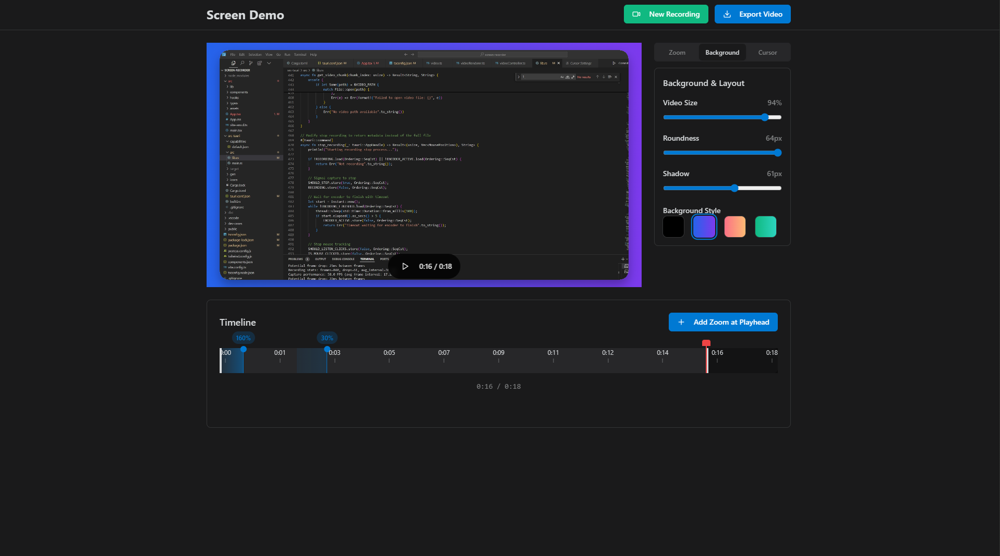

# Screen Recorder with Remotion Integration

A screen recording and editing application with Remotion video export capabilities.

## Features

- Screen recording with cursor tracking
- Video editing with timeline
- Zoom and text effects
- Background customization
- Two export options:
  - Standard canvas-based export
  - High-quality Remotion export (experimental)

## Remotion Integration

This project includes integration with [Remotion](https://www.remotion.dev/), a framework for creating videos programmatically using React.

### How It Works

1. The app records your screen and captures mouse movements
2. You can add zoom effects and text overlays to the recording
3. When exporting, you can choose between:
   - Standard export (using Canvas API)
   - Remotion export (for higher quality)

### Current Implementation

The Remotion integration is currently implemented as a client-side demo. For a full implementation, a Node.js backend would be required to utilize Remotion's server-side rendering capabilities.

### Usage

1. Record your screen
2. Edit your video with effects
3. Click the "Remotion Export" button
4. Preview how your video will look in Remotion
5. Click "Start Export" to generate the video

## Development

### Prerequisites

- Node.js (v16+)
- npm or yarn

### Installation

```bash
npm install
```

### Running the Application

```bash
npm run dev
```

### Building for Production

```bash
npm run build
```

## Future Plans

- Server-side Remotion rendering for higher quality exports
- More export options and effects
- Audio support
- Additional editing features

## Learn More

- [Remotion Documentation](https://www.remotion.dev/docs/)
- [Remotion Server-Side Rendering](https://www.remotion.dev/docs/renderer/render-media)
- [Remotion Player](https://www.remotion.dev/docs/player/integration)

<div align="center">
  
  <h1>Screen Demo</h1>
  <p>An open-source screen recording and editing tool with zoom animation capabilities.<br/>A lightweight open-source alternative to Screen.studio.</p>
</div>


## Download

<div align="center">
  <h3>
    <a href="https://github.com/njraladdin/screen-demo/releases">Download for Windows →</a>
  </h3>
</div>

## Features

- **Screen Recording**
  - Record any monitor
  - Capture mouse movements and clicks
  - Multi-monitor support

- **Video Effects**
  - Add smooth zoom animations
  - Customize background styles and gradients
  - Enhanced cursor visualization
  - Adjust video scale and borders

- **Simple to Use**
  - Easy trim and edit
  - Quick export
  - No account needed

## Installation

1. Download the latest release for your platform from the [Releases](https://github.com/njraladdin/screen-demo/releases) page

2. Or build from source:
```bash
# Install dependencies
npm install

# Run in development
npm run tauri dev

# Build
npm run tauri build
```

## Usage

1. Click "Start Recording" and select your monitor
2. Record your screen
3. Stop recording when done
4. Add zoom animations by clicking "Add Zoom at Playhead" 
5. Adjust zoom level, position and timing
6. Export the final video

## Development

Built with Tauri, React, and TypeScript.

Requirements:
- Node.js 16+
- Rust toolchain
- Windows 10+

## License

This project is licensed under the MIT License

